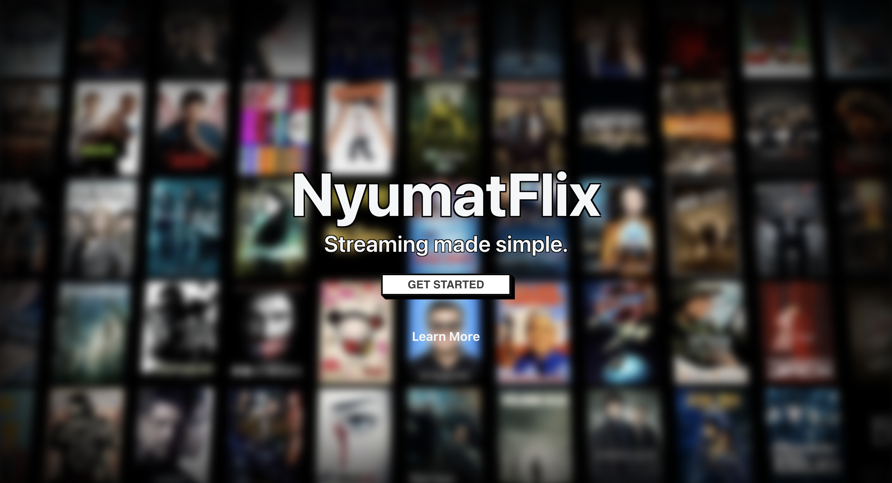

# [NyumatFlix](https://nyumatflix.com)

Welcome to the NyumatFlix repository and home of the source code!

NyumatFlix is a ~~totally legal~~ streaming service that allows you to watch your favorite movies and TV shows for free.

The app is built with the 'ancient' Next.js pages router, TypeScript, Tailwind CSS, Mantine, Framer Motion, and Tabler Icons. It uses The Movie Database (TMDb) API to fetch movie and TV show data.

## 🚀 Features 🚀

- Browse popular movies and TV shows
- Search for movies and TV shows
- View movie and TV show media content
- Watch media trailers (if available)
- View movie and TV show cast and crew

### Coming Soon

- User accounts
- Watch lists
- More filters and sorting options
- Theme switcher
- PWA support
- More...

## ⚡️ Tech Stack ⚡️

- [Next.js](https://nextjs.org/)
- [TypeScript](https://www.typescriptlang.org/)
- [Tailwind CSS](https://tailwindcss.com/)
- [Jest](https://jestjs.io/)
- [ESLint](https://eslint.org/)
- [Prettier](https://prettier.io/)
- [Husky](https://typicode.github.io/husky/#/)
- [Mantine](https://mantine.dev/)
- [Framer Motion](https://www.framer.com/motion/)
- [Tabler Icons](https://tablericons.com/)
- [The Movie Database (TMDb) API](https://www.themoviedb.org/)
- [Intersect Observer API](https://developer.mozilla.org/en-US/docs/Web/API/Intersection_Observer_API)
- [FMHY](https://fmhy.net/)

> [!TIP]
> If you made it to this point, you're probably wondering where the streams come from. I recommend checking out that last link in the tech stack list. 😉

## 🏃🏾‍♂️ Run NyumatFlix Locally 🏃🏾‍♂️

To run the project, follow these steps:

1. Clone the repository

```bash
git clone https://github.com/Nyumat/NyumatFlix.git
```

2. Create a `.env.local` file in the root directory of the project and add the following environment variables:

```bash
# The API key for The Movie Database (TMDb)
API_KEY=
# First is for movies, second one is for TV shows. Both are required.
NYUMATFLIX_VPS=
NYUMATFLIX_VPS2=
```

> [!TIP]
> I purposely left the API key blank so that you can get your own. You can get one by creating an account on [TMDb](https://www.themoviedb.org/). The VPS URLs are for the streams. You can get them from the FMHY website.

3. Install dependencies

```bash
npm install
```

4. Run the development server

```bash
npm run dev
```

5. Open [http://localhost:3000](http://localhost:3000) with your browser to see the result.

## 📝 Scripts 📝

| Script         | Description                                                          |
| -------------- | -------------------------------------------------------------------- |
| `dev`          | Run Next.js development server.                                      |
| `build`        | Build the Next.js application.                                       |
| `start`        | Start the Next.js production server.                                 |
| `preview`      | Start the Next.js server on port 3001 for previewing.                |
| `format`       | Format code using Prettier for specified file patterns.              |
| `check-format` | Check if code is formatted correctly using Prettier.                 |
| `type-check`   | Run TypeScript type-checking using the `tsc` compiler.               |
| `lint`         | Lint code using ESLint for TypeScript and TypeScript React files.    |
| `lint:fix`     | Fix linting issues using ESLint for TypeScript and TypeScript React. |
| `test-all`     | Run type-checking, linting, and code formatting checks.              |
| `prepare`      | Install Husky Git hooks.                                             |

## 🤝 Contributing 🤝

Contributions are welcome. I'm currently working on a test suite so that contributions can be made easier without breaking NyumatFlix. If you have any questions, bug findings, or feature requests, feel free to open an issue.

## 📄 License 📄

[MIT](LICENSE)

## ⚠️ Disclaimer ⚠️

> [!CAUTION]
> NyumatFlix is a project for educational purposes only. It is not intended for commercial use. The project is not affiliated with The Movie Database (TMDb) or FMHY. Additionally, this project does not host any media content, as the streams are provided by FMHY. For DMCA takedown requests, please contact FMHY, not me.
